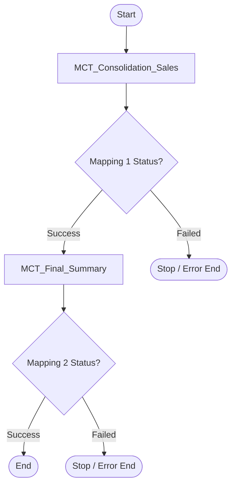
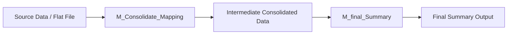

# Omnichannel Status Consolidation – IICS Project

## Overview

This repository contains an Informatica Intelligent Cloud Services (IICS) project for consolidating omnichannel sales and status data into a final summary output.

The project is designed to:

* Read source sales/status data from flat file or source systems
* Consolidate channel-level records
* Validate mapping execution status
* Control downstream execution through a taskflow
* Generate a final summary dataset

The project includes reusable mappings, mapping tasks, taskflows, and connection metadata exported from IICS.

---

## Repository Contents

```text
Target_Mappers.Design.zip
│
├── M_Consolidate_Mapping
├── M_final_Summary
├── MCT_Consolidation_Sales
├── MCT_Final_Summary
├── TF_Omnichannel_Status
├── Conn_Mock_FF_SRC
└── Project Metadata
```

### Main Components

| Component                 | Type         | Purpose                                      |
| ------------------------- | ------------ | -------------------------------------------- |
| `M_Consolidate_Mapping`   | Mapping      | Consolidates omnichannel source records      |
| `M_final_Summary`         | Mapping      | Builds final summarized output               |
| `MCT_Consolidation_Sales` | Mapping Task | Executes consolidation mapping               |
| `MCT_Final_Summary`       | Mapping Task | Executes final summary mapping               |
| `TF_Omnichannel_Status`   | Taskflow     | Controls end-to-end execution sequence       |
| `Conn_Mock_FF_SRC`        | Connection   | Flat file source connection used by mappings |

---

## Workflow Logic

The taskflow executes the consolidation mapping first.

* If `MCT_Consolidation_Sales` succeeds, the final summary mapping is executed.
* If `MCT_Consolidation_Sales` fails, the taskflow stops and `MCT_Final_Summary` is not executed.
* After both tasks complete successfully, the workflow ends.

---

## Workflow DFD / Taskflow



---

## Detailed Execution Flow



---

## Project Structure in IICS

```text
Project: training_hcl
│
├── Mapping: M_Consolidate_Mapping
├── Mapping: M_final_Summary
├── Mapping Task: MCT_Consolidation_Sales
├── Mapping Task: MCT_Final_Summary
└── Taskflow: TF_Omnichannel_Status
```

---

## Import Steps in Informatica IICS

1. Open Informatica Cloud.
2. Go to Data Integration.
3. Navigate to Import / Export.
4. Import `Target_Mappers.Design.zip`.
5. Verify the following objects are imported:

   * Connections
   * Mappings
   * Mapping Tasks
   * Taskflow
6. Update connection parameters if required.
7. Run `TF_Omnichannel_Status`.

---

## Execution Sequence

1. `TF_Omnichannel_Status` starts.
2. `MCT_Consolidation_Sales` executes.
3. Taskflow checks mapping status.
4. If successful, `MCT_Final_Summary` executes.
5. Final summary output is generated.
6. Taskflow ends.

---

## Failure Handling

The taskflow contains conditional execution logic.

* Mapping 2 runs only if Mapping 1 is successful.
* Any failure in Mapping 1 stops the complete flow.
* Any failure in Mapping 2 terminates the taskflow and logs the error.

Pseudo-condition used in decision task:

```text
If MCT_Consolidation_Sales.status == SUCCEEDED
    Run MCT_Final_Summary
Else
    Stop Taskflow
```

---

## Technologies Used

* Informatica Intelligent Cloud Services (IICS)
* Informatica Cloud Data Integration
* Taskflow
* Mapping Task
* Flat File Source Connection

---

## Use Case

This project can be used in scenarios such as:

* Omnichannel sales consolidation
* Daily sales reporting
* Multi-source data integration
* Summary dashboard preparation
* Validation-based workflow execution

---

## Future Enhancements

* Add email notification on failure
* Add parameterized source file handling
* Add logging and audit table updates
* Add additional decision branches for retry logic
* Add parallel execution for multiple channel mappings

---

## Author

Created as part of an IICS / Informatica project for training and workflow orchestration.
